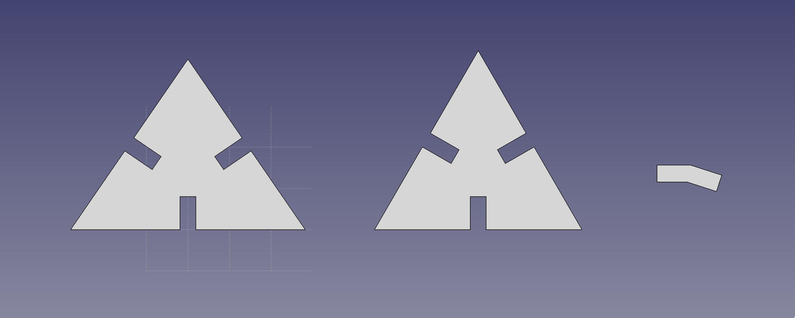
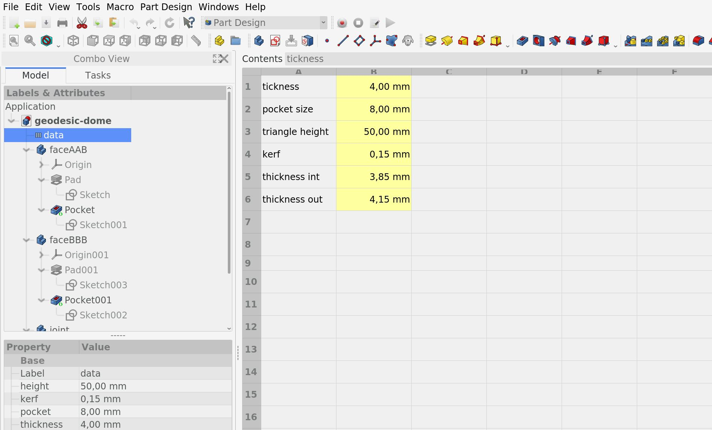
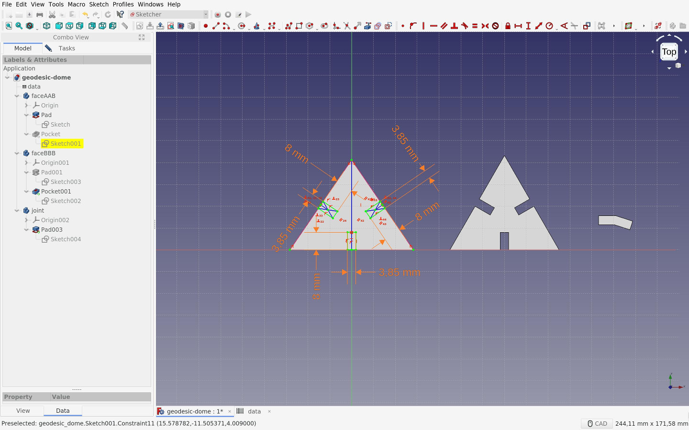
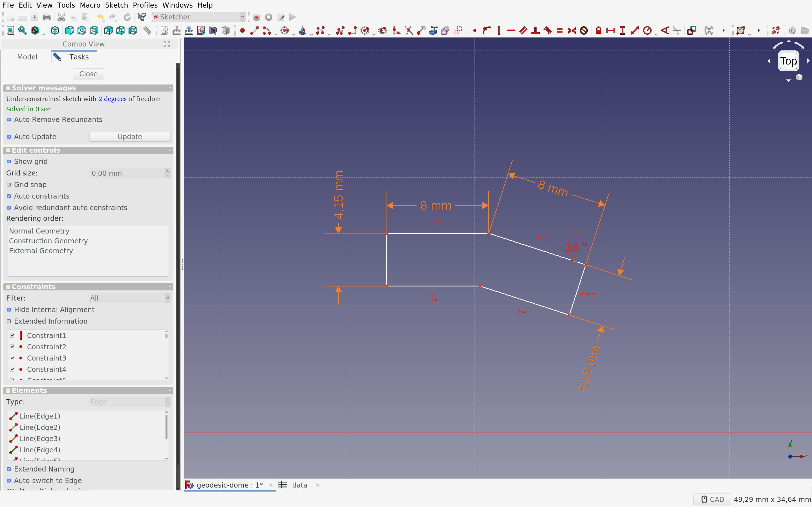
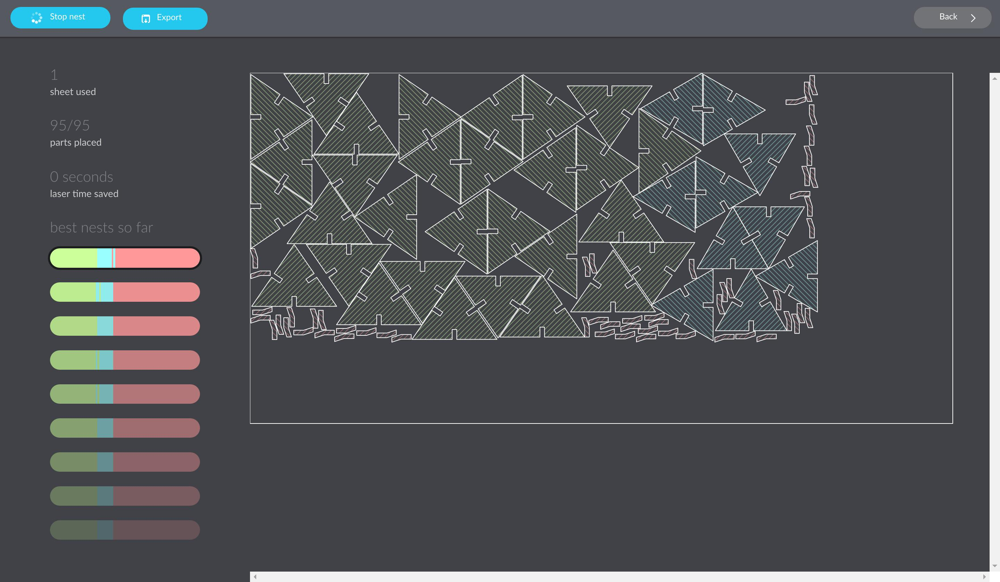

This week is about exploring the possibilities of the computer-controlled cutting machines present in Fab Labs : the lasercutter and the vinylcutter. The first (group) assignement is to understand how the machines work and to obtain some of the values (specific to these machines) necessary to properly prepare the files before sending them to the machines. The second (personal) assignement is to design, lasercut, and document a parametric construction kit, and to cut something with the vinylcutter.

# Lasercutter

The laser cutter is an excellent machine: it gives quick results, it is easy to learn, it works with different types of material (wood, acrylic, cardboard, etc.) and the cutting is very precise. Using joints allows you to go from 2D to 3D objects. It makes the laser cutter one of the best machines to quickly prototype an idea.

## Basics of lasercutting

### Security

Because the lasercutter is fun and easy to use, it's also easy to forget that it can be dangerous. Here are some basic rules that accompany the use of the machine:

- Do not leave the machine unattended
- Cut only materials that you know are safe (no chromium, no carbon, no PVC, no PVP)
- Always use the filter and wait for the smoke to disappear before opening the cover
- Make sure you know what to do in case of fire

### Focus

The focus is calculated based on the distance between the material and the laser. It must be adjusted before any cutting, depending on the thickness of the material.

<video><source src="focus.mp4"></video>

Setting the focus is a mechanical & low-tech process, the idea is simply to obtain the distance value between the nozzle and the material.

### Speed & power 

Speed and power are the two parameters that we have to adjust according to the desired results. The speed is defined in millimeters per second (0-400) and the power is defined in (a relative) percentage (0-100%). To cut something big, you will need to set a high power and a low speed, so that the laser stays longer at the same points and burns the material more. On the other hand, to slightly engrave, set a high speed and a low power, so that the laser does not have enough time to burn the material.

### Kerf
The laser burns away a portion of material when it cuts through. This is known as the laser kerf and ranges from 0.08mm – 1mm depending on the material properties and thickness. It is super important the know the kerf value and to integrate it into the design, if we want to cut things perfectly.

## Get to know the machine

I'm part of two different groups for the group assignement, simply because I was around and it's always good to know a bit more about the differences between the machines.

### Trotec Speedy 100

The first group I'm part of is composed by [Arman](http://fabacademy.org/2020/labs/barcelona/students/arman-najari), [Benjamin](http://fabacademy.org/2020/labs/barcelona/students/benjamin-scott/), [David](http://fabacademy.org/2020/labs/barcelona/students/david-prieto/), [Minh Tue](http://fabacademy.org/2020/labs/barcelona/students/tue-ngo/), and me.

We used this [test file](https://www.thingiverse.com/thing:728579) provided by the instructors to test the lasercutter [Trotec Speedy 100](https://www.troteclaser.com/es/maquinas-laser/grabadora-laser-speedy/) with different materials. Here are the specs of the machine:

- Work area: 600 x 300mm
- Height: 132mm
- Laser power: 12-60W

We chose to proceed with Cardboard 4mm and Plywood 4mm because we can find nice leftovers of those materials. For the `Material Settings` in `TROTEC JobControl`, we followed the information on the Laser Cut Sample at the Fab Lab. The parts to be engraved were color-coded with black, and the parts to be cut were color-coded with red.

<video><source src="test.mp4"></video>

Here are the values we've collected by testing the Trotec Speedy 100.

| Machine | Material | Technique | Speed | Power |
| --- | --- | --- | --- | --- |
| Trotec Speedy 100 | Plywood 4mm | Engrave | 100 | 80 |
| Trotec Speedy 100 | Plywood 4mm | Cut | 1 | 75 |
| Trotec Speedy 100 | Carboard 4mm | Engrave | 100 | 60 |
| Trotec Speedy 100 | Carboard 4mm | Cut | 1 | 60 |

### Multicam 2000

And the other group I'm part of is composed by [Bruno](https://fabacademy.org/2020/labs/barcelona/students/bruno-molteni), [Marco](https://fabacademy.org/2020/labs/barcelona/students/marco-cataffo), [Roger](https://fabacademy.org/2020/labs/barcelona/students/roger-anguera), and me.

Our idea was to use one of the Trotec machines, either the 100 or the 400, but they were being used so we finally decided to do it on the old and huge [Multicam 2000](https://wiki.fablabbcn.org/Multicam_2000_Laser_Cutter). Our instructors Mikel Llobera & Oscar González Fernández helped us throught the process. This would have been really impossible without them, given the complicated interface of the machine, not to mention that some parts of it are not working properly.

On the multicam, you have to go through it's own software called EnRoute, that turns a DXF file into gcode that the machine can read. With EnRoute open and connected to the machine, you can load the file from it's 1980's-style handheld interface, which is both cumbersome and amusing at the same time.

Once we had the piece on EnRoute, after a few crashes of the software due, we think, to the amount of different lines on the design, we learned that we would have issues with raster on that machine, so we had to remove the parts of the design that were supposed to be rastered.

<video><source src="multicam-test.mp4"></video>

We didn't do enough tests to know well the machine because of the time we'd at our disposition. It would be interesting to compare the results with the other machine to know how much energy it does require and how fast is the industrial machine compare to the others. Anyway, rere are the values we've collected by testing the Multicam2000.

| Machine | Material | Technique | Speed | Power |
| --- | --- | --- | --- | --- |
| Multicam 2000 | Cardboard 4mm | Cut | 100 | 100 |

## Basic test to calculate the kerf

I've seen on [various](http://fab.academany.org/2018/labs/fablabamsterdam/lasercut/group1.html) [documentations](https://fabacademy.org/2019/labs/waag/students/anne-vlaanderen/assignments/week4.html) a basic test which we can execute in order to calculate the kerf of a specific machine on a specific material. We wanted to test it by ourself.

The idea is to cut a material several times, bring the cut pieces together and compare the final total width with the initial width. The difference should be the space left by the cut, from which we can get the value of the kerf.

| Material | Intended | Actual | Difference | Kerf (difference/10) | Offset (kerf/2) |
| --- | --- | --- | --- | --- | --- |
| Cardboard 4mm | 200mm | 194mm | 6mm | 0.3mm | 0.15mm |

This technique could be applied to different materials with different settings (speed/power) by using this single template. 

---

# Geodesic dome

A [geodesic dome](https://en.wikipedia.org/wiki/Geodesic_dome) is a structure based on a geodesic polyhedron. The triangular elements of the dome are structurally rigid and distribute the structural stress throughout the structure, making geodesic domes able to withstand very heavy loads for their size.

## Design

I wanted to build a geodesic dome made up of two triangular faces and a joint. But because the structure of a geodesic dome is mainly made up of sticks instead of faces, finding the documentation was not as easy as expected. Finally, [this website](https://simplydifferently.org/Geodesic_Dome_Notes?page=3#2V%20Icosahedron%20Dome) helped me to find the geometric values.

- 30 x triangle A-A-B (55.57°, 55.57°, 68.86°)
- 10 x triangle B-B-B (60.00°, 60.00°, 60.00°) 
- 55 connectors (with an angle of 18°)

I used FreeCAD to design the dome elements. I first filled out a spreadsheet with the parameters that I collected, so that I could use these parametric values to design the different parts and be able to change things quickly in case of change.

Finding the kerf was a key point in this project because the pieces had to fit perfectly to keep the entire structure as solid as it should be. Because the dome will be made of `plywood 4mm` and due to the machine and its parameters, the kerf value is `0.15mm`.

I added this value for the connecteor measurement, because the part had to fit into another. The lasercut decreases the size of the part, so by adding the value before cutting, I guarantee that the end result will be the expected result.

And vice versa for the opposite part.

### Nesting

In order to avoid wasting material and time (and therefore energy), I had to nest all of my shapes (95 in total) together as compact as possible. To achieve this perilous mission, I used [Deepnest](https://deepnest.io/), an open source nesting application.

This tool does only one job and it does it very well.

## Cutting

I first did a test on a cardboard to check if my design was well done and if the parts fit together, before cutting a more precious sheet of wood. It *seemed* to be the case.

I did another test of the same three pieces on the real sheet of plywood I wanted to use, ultimate test before cutting the whole sheet. It was sucessful, everything seemed to fit correctly. Let's (laser) cut it.

<video><source src="dome-cutting.mp4"></video>

## Assembly

Unforntunately, while assembling the dome, I realized that I messed up with the triangles sizes. I've defined the height of the triangle, from its base to its summit, instead of measuring one its side … precipitation error. I was running out of time and the machines were hyper busy at the lab, so I decided to stop my test. I had enough information about the use of the lasercutters and I didn't want to waste more wood.

I ended with a weird half geodesic dome that isn't as solid as it should be but wich was super fun to build, from A to Z.

---

# The most common password ever

According to [this page](https://en.wikipedia.org/wiki/List_of_the_most_common_passwords), the most common password ever is … `123456`. It's so basic and evident I wanted to stick it on my laptop to send the subtle message to the people around me that their password is *maybe* not the best. And you, is this one of your passwords?

The process of cutting something with a vinylcutter is straightforward:

- Export your .EPS file and import it into the software of the machine
- Prepare your sheet of paper and insert it into the machine (from back to front)
- Set the size of the sheet via the machine commands and tell it to the software running on the computer attached to it
- Press the *Print* button

The next step is the get your cut out of the sheet, wich may not be easy depending on your design, if it's detailed or not. 

A good practice is to apply several strips of adhesive tape on the cut sheet to stick the different pieces together and then apply it where you want to stick your sticker. It works *almost* like a charm (it always does, right?).

The font used: is open-source; is designed by Raphaël Bastide; is called Terminal Grotesque. [Find it on Github](https://github.com/raphaelbastide/Terminal-Grotesque/).

---

# Files

- Lasercutting tester ([SVG](files/lasercutting-tester.svg)) 
- Kerf tester ([FreeCAD](files/kerf-tester.FCStd) / [DXF](files/kerf-tester.dxf))
- Geodesic dome parts ([FreeCAD](files/geodesic-dome.FCStd) / [DXF](files/geodesic-dome-4mm-nest.dxf))
- The most common password ever ([EPS](files/password.eps))
